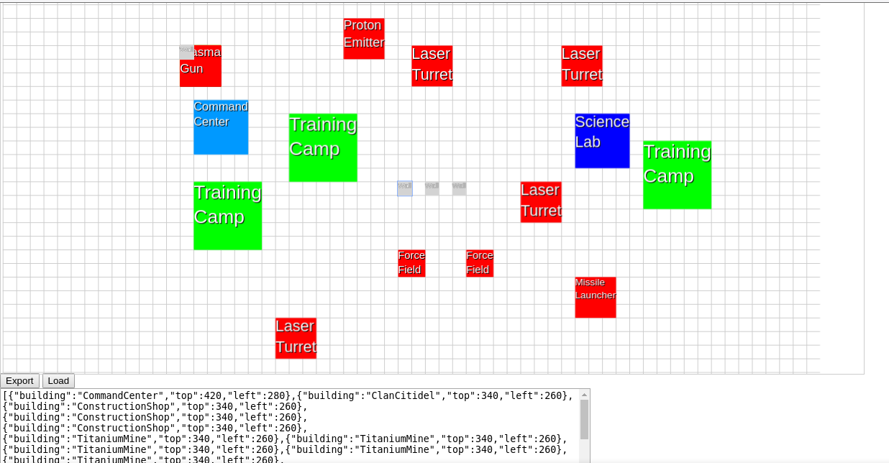

#### Screenshot

#### About

**[INCOMPLETE]**

This is a utility that was meant to help me organize and place game pieces in my camp for the mobile game Clash & GO: AR Strategy, to find the best defensive strategy.

#### Setup

1. Use `addItem()` in `index.html` to add the number of each element you own, to the drag and drop grid.

#### Run

1. Open `index.html` in a browser.

#### Dependencies

- jQuery
- Lodash
- Fabric.JS
- SASS / SCSS
